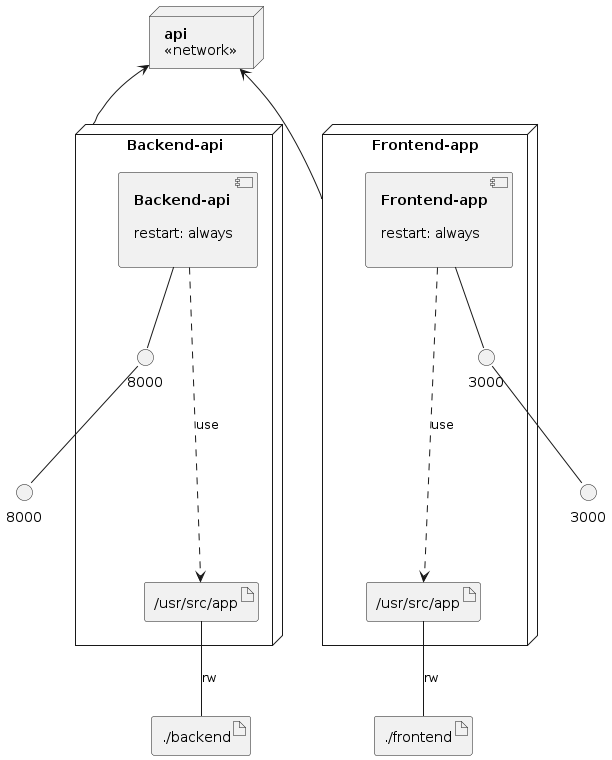

# Sample docker-compose Project With MySQL DBaaS
#### A sample project using docker-compose with Node and React.JS containers.
#### Also uses a MySQL DBaaS like AWS RDS or GCloud CloudSQL.
#### This project is meant to give you an understanding of how to formulate your docker development environment for developing web apps using React.JS, Node.JS, and a cloud SQL DBaaS like AWS RDS.

- Express Server

- React.JS Client

# SETUP

## Initial setup
First make sure to open a terminal window to `./backend` and `./frontend` and from there run `yarn` or `npm install` in both directories to install the necessary packages. 

Create a file in the `./frontend` folder called `.env` and add the the following to it (if it is not already there):
```
CHOKIDAR_USEPOLLING=true
```

Create a file in the `./backend` folder called `.env` and add the the following to it:

NOTE: You will need to share the values in this `.env` file in the backend folder with your team members, it is not recommended you push this file to your GitHub repo as it may expose your secrets to the world!
```
# POPULATE WITH YOUR OWN VALUES SPECIFIED IN DATABASE CREATION!
# mysql database name
MYSQL_DB=
# mysql port (usually 3306)
MYSQL_PORT=
# mysql cloud database login user
MYSQL_CLOUD_USER=
# mysql cloud database login password
MYSQL_CLOUD_PASS=
# mysql cloud database host URL
MYSQL_CLOUD_HOST=

```

## MySQL setup
Once you have set up you mysql database on a DBaaS provider like AWS RDS or GCloud CloudSQL, ensure that the database is publicly accessible on the port you used in setup (usually 3306). Then access the database and run the commands provided in `./backend/mysql_setup.sql`. 

Once you have run those commands, in `./backend/.env` add all the values that you were provided. Specifically the host, user, pass, and port of the database.

## Running the project
After installing the packages and entering your cloud DBaaS connection details, all you need to do is run `docker-compose up` from the root directory of the project to have the `docker-compose` file automatically spin the containers up for you.

If you want to run a terminal in detached mode (so you can close the window and it wont stop the containers) then type `docker-compose up -d` for a headless start instead.

## Stopping the project
As always make sure to type `docker-compose down` to shut the containers down and close everything up.

## [Running the project on an EC2 server](CloudDeploy.md)
[Click here](CloudDeploy.md) to read the directions on how to deploy the project to the cloud on an EC2 instance for all to visit!
___
Hope this helps!

Liam


### Infrastructure model

